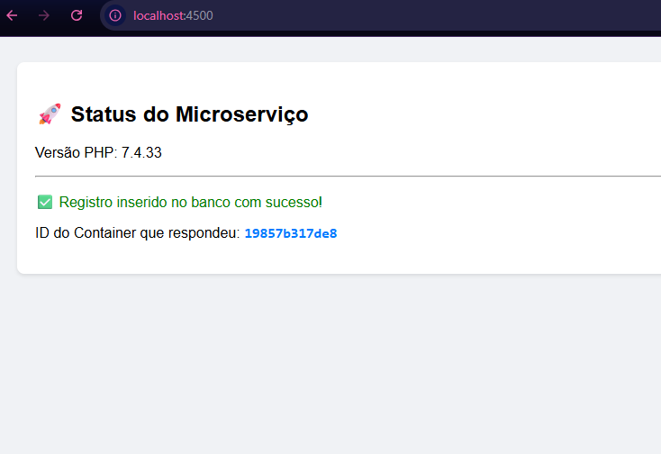

# 🚀 Toshiro Shibakita - Edição Especial Docker & Microserviços

Este projeto é uma evolução do desafio prático sobre Docker e Microserviços. A aplicação simula um cenário real de alta disponibilidade, onde um balanceador de carga distribui o tráfego entre múltiplas instâncias de um servidor web, garantindo que o sistema continue operando mesmo sob carga ou falha de uma instância.

## 🏗️ Arquitetura do Projeto

A estrutura foi desenhada utilizando o conceito de **Escalabilidade Horizontal**:

1.  **Load Balancer (Nginx):** Atua como a porta de entrada na porta `4500`. Ele recebe as requisições e as distribui utilizando o algoritmo *Round Robin* para os servidores de aplicação.
2.  **Nodes de Aplicação (PHP 7.4):** Três containers independentes (`app1`, `app2` e `app3`) processam as requisições. Cada vez que você atualiza a página, um container diferente responde, o que pode ser verificado pelo ID do Host exibido na tela.
3.  **Banco de Dados (MySQL 5.7):** Um container centralizado que armazena as informações inseridas pelas instâncias de aplicação.

## 🛠️ Tecnologias Utilizadas

*   **Docker & Docker Compose** para orquestração de containers.
*   **Nginx** como Load Balancer e Servidor de Proxy Reverso.
*   **PHP 7.4** para a lógica de backend.
*   **MySQL 5.7** para persistência de dados.

## 🚀 Como Executar o Projeto

Certifique-se de ter o **Docker** e o **Docker Compose** instalados em sua máquina.

1.  **Clone o repositório:**
    ```bash
    git clone https://github.com/franciscamac/toshiro-shibakita-plus.git
    cd toshiro-shibakita-plus
    ```

2.  **Suba o ambiente:**
    ```bash
    docker compose up --build -d
    ```

3.  **Acesse no navegador:**
    Vá para [http://localhost:4500](http://localhost:4500)

4.  **Teste o Load Balancer:**
    Atualize a página (F5) várias vezes e observe o campo **"ID do Container"** mudar. Isso prova que o Nginx está distribuindo a carga entre os containers `app1`, `app2` e `app3`.

## 📸 Demonstração

*(Dica: Após tirar o print da sua tela funcionando, salve a imagem na pasta do projeto como `resultado.png` e atualize o link abaixo)*



---
Desenvolvido por [franciscamac](https://github.com/franciscamac) como parte do desafio de Docker e Microserviços.
